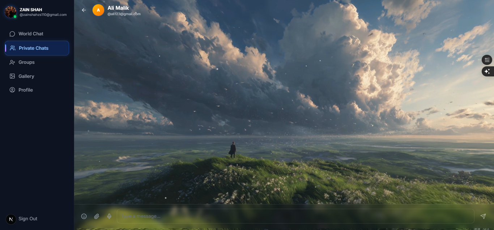

<!-- README.md for Zain Chatting App -->
<!-- README.md for Zain Chatting App -->

# 💬 Zain Chatting App


*A full‑featured real‑time chat application with modern glassmorphism UI, smooth animations, and a rich set of messaging tools.*


[](https://zain-chat.vercel.app)
[](https://github.com/zainshah3464/ModernChattingWebsite)

---

## 📖 Table of Contents

- [✨ Features](#-features)
- [📸 Screenshots](#-screenshots)
- [🛠 Tech Stack](#-tech-stack)
- [🚀 Getting Started](#-getting-started)
- [📂 Project Structure](#-project-structure)
- [👨‍💻 Developer](#-developer)
- [📄 License](#-license)
- [🌟 Acknowledgements](#-acknowledgements)

---

## ✨ Features

| Category | Highlights |
|----------|------------|
| 🔐 **Authentication** | Email/Password + Google OAuth, email verification ready |
| 🌍 **World Chat** | Public real‑time room, file sharing, reactions |
| 💬 **Private Chat** | 1‑on‑1 messaging, read receipts, online status, typing indicator |
| 👥 **Group Chat** | Create groups, add/remove members, promote admins, group avatar |
| 🎤 **Voice Messages** | Record and send audio clips directly |
| 📎 **File Sharing** | Images, videos, audio, documents – upload & preview |
| 😍 **Emoji Reactions** | Real‑time animated reactions per message (single reaction per user) |
| ⌨️ **Typing Indicators** | See who’s typing in world, private, and group chats |
| ✅ **Read Receipts** | Double‑tick / seen‑by count for messages |
| 📷 **User Gallery** | Upload media, view in a grid, lightbox slideshow |
| 👤 **User Profiles** | Edit avatar, username, full name |
| 🟢 **Online Presence** | Green dot on avatars of online users |
| 🔔 **Unread Badges** | Sidebar & mobile navigation show live unread counts |
| 🌐 **Responsive Design** | Optimised for mobile, tablet, and desktop |
| 🎨 **Glassmorphism UI** | Semi‑transparent backgrounds, blur, and gradients |
| ✨ **Animations** | Framer Motion throughout – page transitions, hover effects, message bubbles |

---

## 📸 Screenshots

### World Chat


### User Search (Private Chat Users)


### Private Chat  
*Best personal messaging experience*  


### 404 Page


---

## 🛠 Tech Stack

| Layer        | Technologies |
|--------------|--------------|
| **Frontend** | Next.js 16 (App Router), TypeScript, Tailwind CSS, Framer Motion |
| **Backend**  | Supabase (Auth, PostgreSQL, Storage, Realtime, Edge Functions) |
| **Deployment** | Vercel (Production) |
| **Icons**    | Lucide React |
| **State**    | React Context API |

---

## 🚀 Getting Started

### Prerequisites

- **Node.js** 18+ and npm/yarn
- A [Supabase](https://supabase.com) project
- (Optional) Vercel account for deployment

---

### 👨‍💻 Developer
**Zain Ali Shah**
*Full Stack Developer & Software Engineer*

- **🌐 Portfolio:** zain-main-web.vercel.app
- **📧 Email:** zainshahz110s@gmail.com
-  **💼 GitHub:** @zainshah3464
-  **📸 Instagram:** @zainshah3464

### 📄 License

*This project is licensed under the MIT License.*

**MIT License**

*Copyright (c) 2026 Zain Ali Shah*

Permission is hereby granted, free of charge, to any person obtaining a copy
of this software and associated documentation files (the "Software"), to deal
in the Software without restriction, including without limitation the rights
to use, copy, modify, merge, publish, distribute, sublicense, and/or sell
copies of the Software, and to permit persons to whom the Software is
furnished to do so, subject to the following conditions:

The above copyright notice and this permission notice shall be included in all
copies or substantial portions of the Software.

THE SOFTWARE IS PROVIDED "AS IS", WITHOUT WARRANTY OF ANY KIND, EXPRESS OR
IMPLIED, INCLUDING BUT NOT LIMITED TO THE WARRANTIES OF MERCHANTABILITY,
FITNESS FOR A PARTICULAR PURPOSE AND NONINFRINGEMENT. IN NO EVENT SHALL THE
AUTHORS OR COPYRIGHT HOLDERS BE LIABLE FOR ANY CLAIM, DAMAGES OR OTHER
LIABILITY, WHETHER IN AN ACTION OF CONTRACT, TORT OR OTHERWISE, ARISING FROM,
OUT OF OR IN CONNECTION WITH THE SOFTWARE OR THE USE OR OTHER DEALINGS IN THE
SOFTWARE.

---

### 🌟 Acknowledgements

- **Supabase** – real‑time backend & auth
- **Framer Motion** – animations
- **Lucide Icons** – beautiful icons
- **Tailwind CSS** – styling

 *All open‑source libraries that made this project possible*
 
---
### Made with ❤️ by Zain Ali Shah
---

### 1. Clone the repository

```bash
git clone https://github.com/zainshah3464/ModernChattingWebsite.git
cd ModernChattingWebsite
```
### 2. Install dependencies
```bash
npm install
```
### 3. Set up environment variables
*Create a .env.local file in the root directory:*

**env**
```
NEXT_PUBLIC_SUPABASE_URL=your_supabase_project_url
NEXT_PUBLIC_SUPABASE_ANON_KEY=your_supabase_anon_key
⚠️ Never commit this file – it’s already included in .gitignore.
```
### 4. Database setup
Run the following SQL scripts in your Supabase SQL Editor to create tables, RLS policies, storage buckets, and RPC functions.
*(A full migration script will be added soon.)*

### 5. Start the development server
```bash
npm run dev
Open http://localhost:3000 in your browser. The app will automatically reload when you make changes.
```

### 📂 Project Structure *(Key Folders)*
```
chatapp/
├── app/                  # Next.js App Router pages
│   ├── (main)/           # Authenticated layout (world, private, groups, gallery, profile)
│   │   ├── world/
│   │   ├── private/
│   │   ├── groups/
│   │   ├── gallery/
│   │   └── profile/
│   ├── auth/             # Login, signup, OAuth callback, email confirmation
│   └── layout.tsx        # Root layout (AuthProvider)
├── components/           # Reusable UI components
│   ├── chat/             # ChatInput, MessageReactions, GroupInfoPanel
│   ├── layout/           # Sidebar, MobileNav
│   └── providers/        # PresenceProvider, ReactionsPickerProvider
├── lib/                  # Hooks, Supabase clients, utility functions
│   ├── hooks/            # useAuth, useTypingIndicator, useTheme, useRealtimeChat
│   └── supabase/         # Client & server clients
├── public/               # Static assets (screenshots, logos, favicons)
└── ...
```
